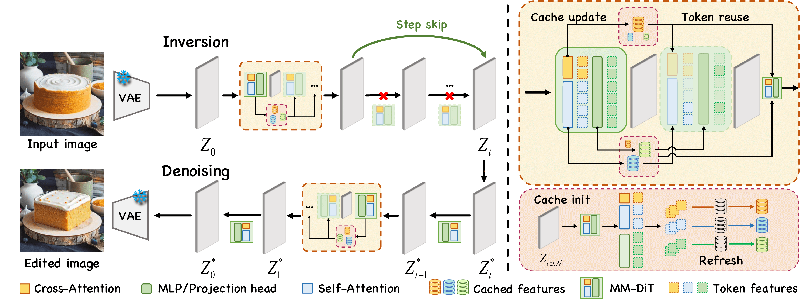

<div align="center">
EEdit ⚡️：Rethinking the Spatial and Temporal Redundancy for Efficient Image Editing
</div>
<div align="center" style="display: flex; justify-content: space-around; flex-wrap: wrap;">
    <a href="#">Zexuan Yan</a><sup>*</sup> &nbsp;•&nbsp;
    <a href="#">Yue Ma</a><sup>*</sup> &nbsp;•&nbsp;
    <a href="#">Chang Zou</a> &nbsp;•&nbsp;
    <a href="#">Wenteng Chen</a> &nbsp;•&nbsp;
    <a href="#">Qifeng Chen</a> &nbsp;•&nbsp;
    <a href="#">Linfeng Zhang</a><sup>†</sup>
</div>
<div align="center" style="font-size: 0.9em">
    <sup>*</sup> Equal Contribution &nbsp;&nbsp;&nbsp; <sup>†</sup> Corresponding Author
</div>


[](https://arxiv.org/abs/2503.10270)
[](https://eff-edit.github.io/)

## 📝 Introduction
<div align="center" style="background-color: white;">
    
</div>
<div align="center" style="background-color: white;">
    
</div>

Inversion-based image editing is rapidly gaining momentum while suffering from significant computation overhead, hindering its application in real-time interactive scenarios. In this paper, we rethink that the redundancy in inversion-based image editing exists in both the spatial and temporal dimensions, such as the unnecessary computation in unedited regions and the redundancy in the inversion progress.

To tackle these challenges, we propose a practical framework, named EEdit, to achieve efficient image editing. Specifically, we introduce three techniques to solve them one by one:
- For spatial redundancy, **spatial locality caching** is introduced to compute the edited region and its neighboring regions while skipping the unedited regions
- **Token indexing preprocessing** is designed to further accelerate the caching
- For temporal redundancy, **inversion step skipping** is proposed to reuse the latent for efficient editing

Our experiments demonstrate an average of **2.46X acceleration** without performance drop in a wide range of editing tasks including prompt-guided image editing, dragging and image composition.


## 🛠️ Installation
```bash
conda create -n eedit python=3.12.3
conda activate eedit
pip install -r EEdit/requirements.txt
```

## 📥 Checkpoints & Datasets
All model weights and datasets are from open-source, free and publicly available channels:

We use FLUX-dev as our experimental model. You can obtain it from either:
- Official Repository: https://github.com/black-forest-labs/flux
- Hugging Face: https://huggingface.co/black-forest-labs/FLUX.1-dev

We use PIE-BENCH as the prompt-guided dataset, you can refer to [link](https://forms.gle/hVMkTABb4uvZVjme9)

We use TF-ICON benchmark as the ref-guided dataset, you can refer to [link](https://github.com/Shilin-LU/TF-ICON)

We use DragBench-DR and Drag-Bench-SR as the drag-guided datasets, you can refer to [link](https://github.com/Visual-AI/RegionDrag)

For masks generated from mapping_file.json, we provide scripts that follows:

```bash
python MyCodes/myutils.py
```

<details>
<summary>📁 Checkpoints Structure</summary>

```bash
weights
├── flux1-dev.safetensors
├── model_index.json
├── scheduler
│   └── scheduler_config.json
├── sd_vae_ft_mse
│   ├── config.json
│   └── diffusion_pytorch_model.safetensors
├── text_encoder
│   ├── config.json
│   └── model.safetensors
├── text_encoder_2
│   ├── config.json
│   ├── model-00001-of-00002.safetensors
│   ├── model-00002-of-00002.safetensors
│   ├── model.safetensors.index-1.json
│   └── model.safetensors.index.json
├── tokenizer
│   ├── merges-1.txt
│   ├── merges.txt
│   ├── special_tokens_map-1.json
│   ├── special_tokens_map.json
│   ├── tokenizer_config-1.json
│   ├── tokenizer_config.json
│   ├── vocab-1.json
│   └── vocab.json
├── tokenizer_2
│   ├── special_tokens_map-1.json
│   ├── special_tokens_map.json
│   ├── spiece.model
│   ├── tokenizer.json
│   └── tokenizer_config.json
├── transformer_config.json
└── vae
    ├── config.json
    └── diffusion_pytorch_model.safetensors
```
</details>


<details>
<summary>📁 Datasets Structure</summary>

```bash
input
├── composition
│   ├── Real-Cartoon
│   │   ├── 0000 a cartoon animation of a sheep in the forest
│   │   │   ├── bg58.png
│   │   │   ├── cp_bg_fg.jpg
│   │   │   ├── dccf_image.jpg
│   │   │   ├── fg35_63d22cda1f5b66e8e5aca776.jpg
│   │   │   ├── fg35_mask.png
│   │   │   └── mask_bg_fg.jpg
│   ├── Real-Painting
│   ├── Real-Sketch
│   ├── Real-Real
    ...

├── drag_data
│   ├── dragbench-dr
│   │   ├── animals
│   │   │   ├── JH_2023-09-14-1820-16
│   │   │   │   ├── meta_data.pkl
│   │   │   │   ├── meta_data_region.pkl
│   │   │   │   ├── original_image.png
│   │   │   │   └── user_drag.png
│   └── dragbench-sr
│       ├── art_0
│       │   ├── meta_data.pkl
│       │   ├── meta_data_region.pkl
│       │   ├── original_image.png
│       │   └── user_drag.png
    ...

├── inpaint
│   ├── annotation_images 
│   │   ├── 0_random_140
│   │   │   ├── 000000000000.jpg
│   │   │   
│   │   ├── 1_change_object_80
│   │   │   ├── 1_artificial
│   │   │   │   ├── 1_animal
│   │   │   │   │   ├── 111000000000.jpg
│   │   │   │   ├── 2_human
│   │   │   │   │   ├── 112000000000.jpg
│   │   ├── 2_add_object_80
│   │   │   ├── 1_artificial
│   │   │   │   ├── 1_animal
│   │   │   │   │   ├── 211000000000.jpg
        ...
│   ├── mapping_file.json
│   └── masks
│       ├── mask-000.png
|       ├── mask-001.png
|       ├── ...
```
</details>

## 🚀 Generation
```bash
cd EEdit && source run_gen.sh
```

## 🙏 Acknowledgements
- Thanks to [ToCa](https://github.com/Shenyi-Z/ToCa) for cache implementations
- Thanks to [Diffusers](https://github.com/huggingface/diffusers) for pipeline implementations
- Thanks to [Region Drag](https://github.com/Visual-AI/RegionDrag) for dragging implementations

## 📝 BibTeX
```tex
@misc{yan2025eeditrethinkingspatial,
      title={EEdit : Rethinking the Spatial and Temporal Redundancy for Efficient Image Editing}, 
      author={Zexuan Yan and Yue Ma and Chang Zou and Wenteng Chen and Qifeng Chen and Linfeng Zhang},
      year={2025},
      eprint={2503.10270},
      archivePrefix={arXiv},
      primaryClass={cs.CV},
      url={https://arxiv.org/abs/2503.10270}, 
}
``` 

## 📧 Contact
yzx_ustc@mail.ustc.edu.cn